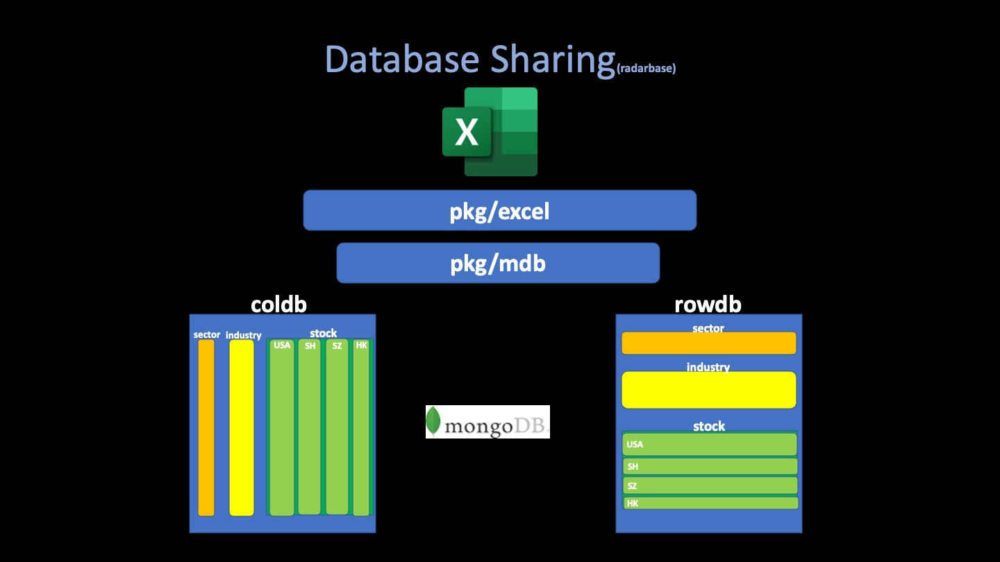
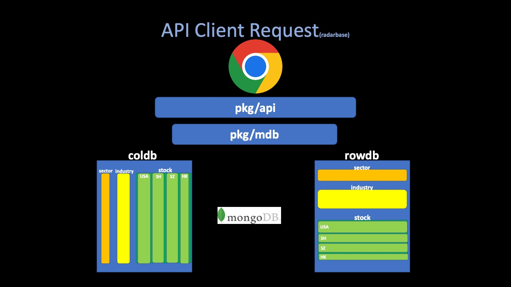

# Packages

The radarbase system is designed around a series of packages (or modules), each with its specific responsibility. The goal is to separate concerns and make the system easier to maintain, test, and extend.

## pkg/mdb

`mdb` package is a layer above MongoDB, allowing it to handle requests, transform them into MongoDB queries, and return processed data to the user. 
The mdb package acts as the primary interface to the MongoDB databases. Two databases are maintained - `coldb` for columnar data and `rowdb` for row data. Columnar data is useful for serving client requests for specific columns which helps in chart rendering. Row data is mainly used for providing complete record information.

### Database

Wrapping the MongoDB client into a custom Database type is not necessary but is often a best practice in software development. Encapsulating the database operations into a specific type allows for **better code organization, reusability, and the ability to add custom behavior or state that might be necessary for application.** 

It also makes it easier to swap out the underlying database technology, if needed, **as the rest of your codebase is interacting with the `Database` type and not directly with MongoDB.** 

Lastly, it makes it easier to mock the Database type for unit testing.

## pkg/excel

This package takes care of parsing the source excel file and converting the data to a format that's more suitable for MongoDB insertion (`[]map[string]interface{}`).

The parser is built above a go package called **[excelize](https://github.com/qax-os/excelize)**

## pkg/api

This package is responsible for handling all API requests to the RadarBase system. The requests are expected from two types of users - regular clients and system administrators. The administrators can update the source excel file which will trigger an update in the database. Clients mainly retrieve data from the server to render charts and other visualizations.

Part of the design goal of radarbase is to **make the client application stateless** since the remote storage (radarbase) holds persistent state, and thus simplifies the design of the application tremendously. 
In our design, the client is only guaranteed to render the data that retrived from server, and interact with users.

This package provides the primary means of interaction for clients to access and manipulate the stock data stored in the MongoDB database.
